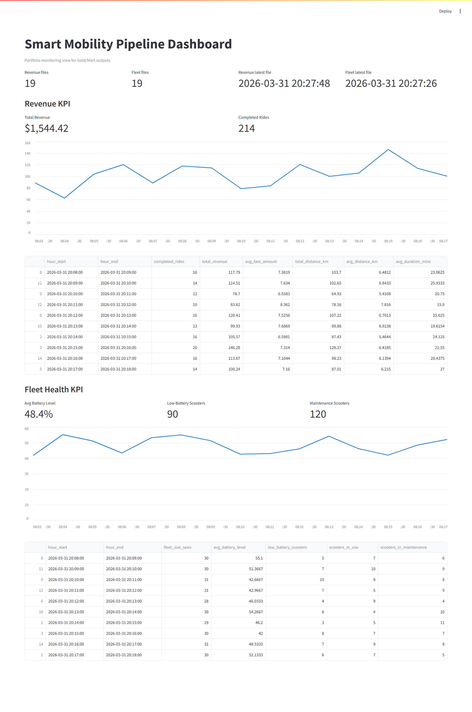

# Smart Mobility Data Platform

## Overview
This repository implements a streaming analytics platform for scooter mobility events.
The pipeline ingests ride and telemetry events, stores them in a Delta Lakehouse
using a medallion design, and exposes business KPIs through a Streamlit dashboard.

Current operating mode is manual execution for transformation layers:
- Bronze is continuous (Kafka -> Delta Bronze)
- Silver/Gold/Mart/Validation are executed on demand via commands

## Repository Structure

```text
.
|-- data_generation/
|   |-- generator.py
|   `-- requirements.txt
|-- infrastructure/
|   `-- docker-compose.yml
|-- spark_streaming/
|   |-- bronze_writer.py
|   |-- silver_writer.py
|   |-- gold_writer.py
|   |-- mart_writer.py
|   `-- validation.py
|-- dashboard/
|   |-- app.py
|   |-- Dockerfile
|   `-- requirements.txt
|-- lakehouse/
|-- commands.txt
`-- README.md
```

## Technology Stack
- Python 3.11+
- Apache Kafka 7.4.0
- Apache Spark 3.5.0
- Delta Lake 3.2.0
- Streamlit 1.37.x
- Docker + Docker Compose

## Data Model by Layer

### Bronze
- Stores raw Kafka payload in `raw_json`
- Adds ingestion metadata (`kafka_timestamp`)
- Paths:
    - `lakehouse/bronze/ride_events`
    - `lakehouse/bronze/telemetry`

### Silver
- Parses JSON payload into typed columns
- Applies data quality checks
- Splits valid and invalid rows
- Paths:
    - Valid: `lakehouse/silver/ride_events`, `lakehouse/silver/telemetry`
    - Invalid: `lakehouse/silver_bad_data/...`

### Gold
- Builds curated fact and dimension tables
- Main tables:
    - `fact_rides`
    - `fact_telemetry`
    - `dim_city`
    - `dim_payment_method`
    - `dim_time_hourly`

### Mart
- Business-facing hourly aggregates
- Main marts:
    - `mart_revenue_hourly`
    - `mart_fleet_health_hourly`

## Local Setup

### 1. Clone repository

```bash
git clone <REPOSITORY_URL>
cd 2_eng_project
```

### 2. Create and activate Python environment (generator)

Windows PowerShell:

```powershell
python -m venv .venv
.\.venv\Scripts\Activate.ps1
pip install -r data_generation\requirements.txt
```

### 3. Start core services

```powershell
cd infrastructure
docker compose up -d
cd ..
```

Services started:
- `mmd-zookeeper`
- `mmd-kafka`
- `mmd-spark`
- `mmd-dashboard`

## End-to-End Execution (Manual)

### Step 1: Start event generator

```powershell
cd data_generation
python generator.py
```

Keep this terminal running.

### Step 2: Verify Kafka ingestion

```powershell
docker exec mmd-kafka kafka-run-class kafka.tools.GetOffsetShell --broker-list localhost:9092 --topic ride_events --time -1
docker exec mmd-kafka kafka-run-class kafka.tools.GetOffsetShell --broker-list localhost:9092 --topic scooter_telemetry --time -1
```

Offsets should increase over time.

### Step 3: Run Silver

```powershell
docker exec -it mmd-spark /opt/spark/bin/spark-submit `
    --conf spark.jars.ivy=/tmp/.ivy2 `
    --packages org.apache.spark:spark-sql-kafka-0-10_2.12:3.5.0,io.delta:delta-spark_2.12:3.2.0 `
    --conf spark.sql.extensions=io.delta.sql.DeltaSparkSessionExtension `
    --conf spark.sql.catalog.spark_catalog=org.apache.spark.sql.delta.catalog.DeltaCatalog `
    /opt/spark_streaming/silver_writer.py
```

### Step 4: Run Gold

```powershell
docker exec -it mmd-spark /opt/spark/bin/spark-submit `
    --conf spark.jars.ivy=/tmp/.ivy2 `
    --packages io.delta:delta-spark_2.12:3.2.0 `
    --conf spark.sql.extensions=io.delta.sql.DeltaSparkSessionExtension `
    --conf spark.sql.catalog.spark_catalog=org.apache.spark.sql.delta.catalog.DeltaCatalog `
    /opt/spark_streaming/gold_writer.py
```

### Step 5: Run Mart

```powershell
docker exec -it mmd-spark /opt/spark/bin/spark-submit `
    --conf spark.jars.ivy=/tmp/.ivy2 `
    --packages io.delta:delta-spark_2.12:3.2.0 `
    --conf spark.sql.extensions=io.delta.sql.DeltaSparkSessionExtension `
    --conf spark.sql.catalog.spark_catalog=org.apache.spark.sql.delta.catalog.DeltaCatalog `
    /opt/spark_streaming/mart_writer.py
```

### Step 6: Run validation

```powershell
docker exec -it mmd-spark /opt/spark/bin/spark-submit `
    --conf spark.jars.ivy=/tmp/.ivy2 `
    --packages io.delta:delta-spark_2.12:3.2.0 `
    --conf spark.sql.extensions=io.delta.sql.DeltaSparkSessionExtension `
    --conf spark.sql.catalog.spark_catalog=org.apache.spark.sql.delta.catalog.DeltaCatalog `
    /opt/spark_streaming/validation.py
```

Expected result:
- Validation summary reports passing checks

## Dashboard

URL:
- `http://localhost:8501`

Dashboard reads mart outputs from:
- `/app/lakehouse/mart/mart_revenue_hourly`
- `/app/lakehouse/mart/mart_fleet_health_hourly`

## Dashboard Screenshots



## Verification Checklist

1. `docker ps` shows all four services up.
2. Generator prints events continuously.
3. Kafka offsets increase over time.
4. Silver command exits without failure.
5. Gold command exits without failure.
6. Mart command exits without failure.
7. Validation command exits without failure.
8. Dashboard shows non-empty KPI cards and tables.

## Troubleshooting

### Spark container not running

```powershell
docker start mmd-spark
docker logs mmd-spark --tail 200
```

### Generator exits immediately
- Confirm virtual environment is active.
- Confirm dependencies are installed from `data_generation/requirements.txt`.
- Confirm Kafka is up: `docker ps`.

### Dashboard has no data
- Run Silver -> Gold -> Mart manually in order.
- Confirm files exist under `lakehouse/mart/`.

## Stop and Cleanup

From `infrastructure/`:

```powershell
docker compose down
```

To remove volumes as well:

```powershell
docker compose down -v
```
