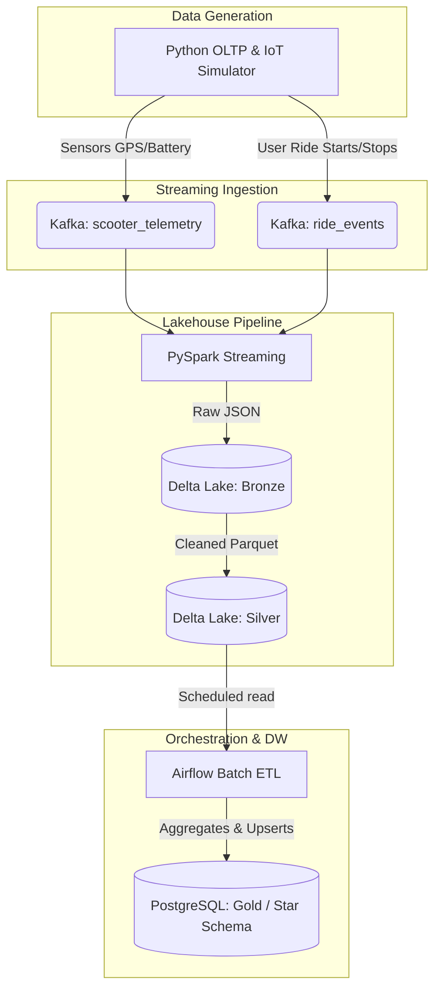

# 🛴 Smart-City Micro-Mobility Data Platform

## 📖 Project Overview
This project simulates the data infrastructure for an E-Scooter / Micro-Mobility startup. It captures real-time IoT telemetry from scooters and transactional data from users, processes it using a Lakehouse architecture, and models it into a dimensional Data Warehouse for business analytics.

## 🎯 Architecture Diagram

## 🛠️ Tech Stack
- **Data Generation:** Python, Faker
- **Message Broker:** Apache Kafka (Dockerized)
- **Data Processing:** Apache Spark (PySpark) & Delta Lake
- **Orchestration:** Apache Airflow
- **Data Warehouse:** PostgreSQL (Star Schema)

## 📝 Sample Data Flow Example
1. **The Event:** A user unlocks scooter `S-404` at 08:00 AM.
2. **Kafka:** A JSON event `{"ride_id": "r-12", "scooter_id": "S-404", "status": "started"}` is sent to the `ride_events` topic.
3. **Bronze Layer:** PySpark reads this from Kafka and appends the raw, nested JSON as a Delta table record.
4. **Silver Layer:** Another PySpark job flattens the JSON, checks for nulls, tracks malformed records in a Dead Letter Queue (DLQ), and saves the clean data.
5. **Gold Layer (Data Warehouse):** At midnight, Airflow triggers a daily job that calculates the total distance and cost of `r-12`, and inserts it into `fact_rides` in PostgreSQL, updating `dim_user` if necessary.

## 🚀 Execution Phases
1. **Phase 1: Infrastructure & Generator** - Spin up Kafka & write Python mocks.
2. **Phase 2: Streaming & Bronze** - PySpark reads Kafka to Delta Bronze.
3. **Phase 3: Silver & Quality** - Deduplication, schema enforcement, DLQ.
4. **Phase 4: Gold & Airflow** - Build Star Schema in Postgres, schedule via Airflow.
